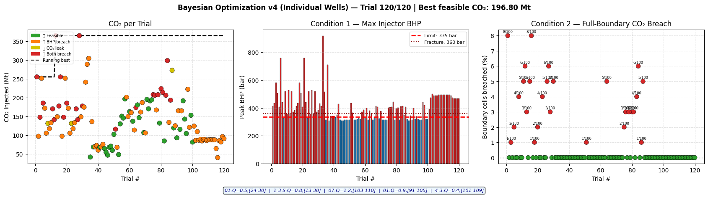
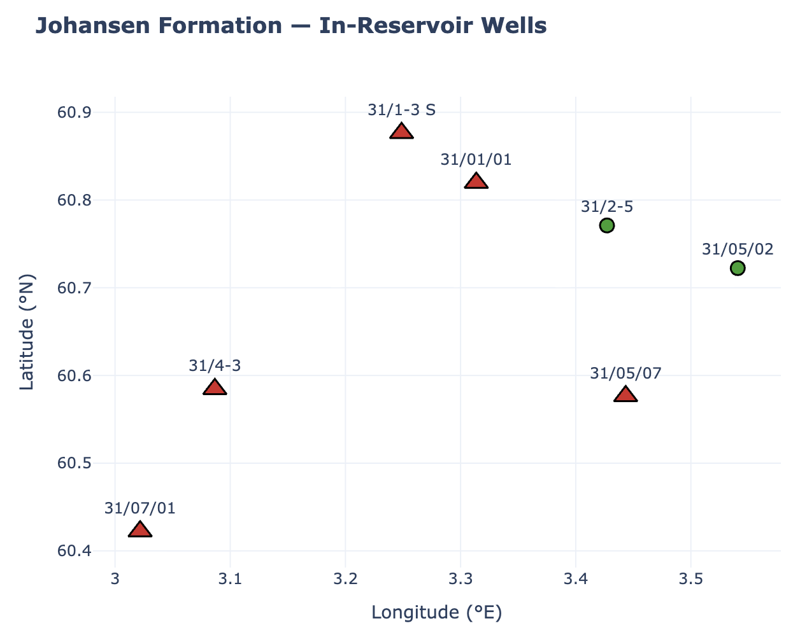
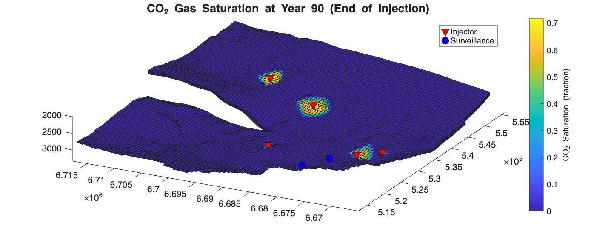
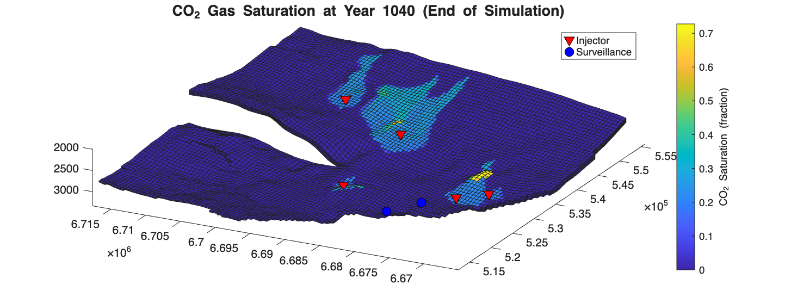
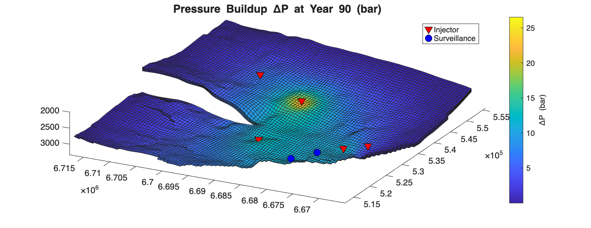
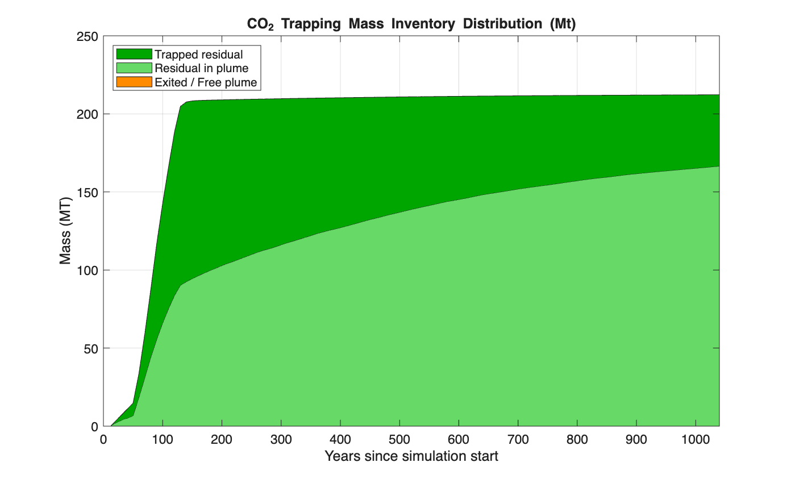
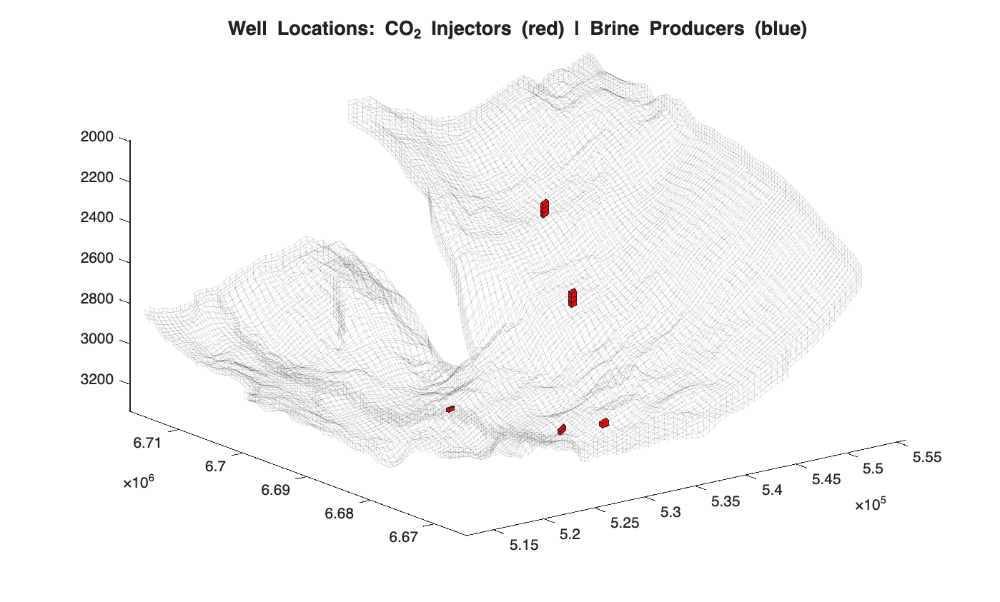
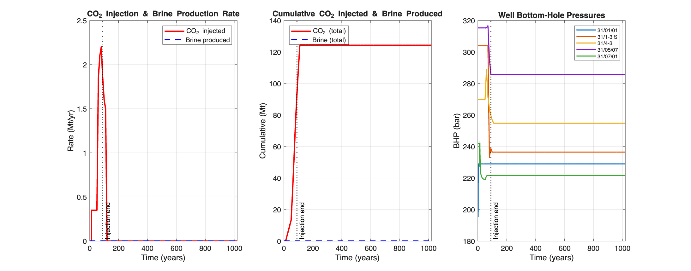
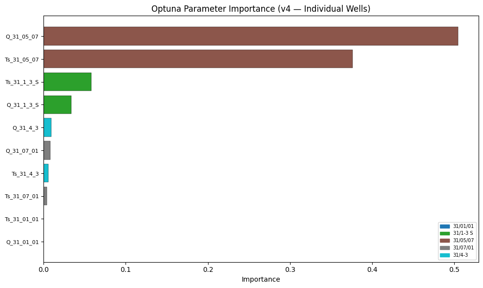

# 🌊 Johansen CO₂ Storage Simulation & Surrogate-Assisted Bayesian Optimization

> **Determining the Optimum Injection Plan for CO₂ Storage in the Johansen Aquifer using Surrogate-Assisted Bayesian Optimization**
>
> Built on **MRST 2026a** (MATLAB Reservoir Simulation Toolbox) — [SINTEF Digital](https://github.com/SINTEF-AppliedCompSci/MRST)

[](https://www.mathworks.com/products/matlab.html)
[](https://www.python.org/)
[](https://optuna.org/)
[](https://www.gnu.org/licenses/gpl-3.0)
[](https://github.com/parthpranav2/johansen_co2_simulation_MRST/releases/tag/v3.0.0)

---

## 📋 Table of Contents

1. [Project Overview](#-project-overview)
2. [Key Results — v3.0.0 (Best Feasible)](#-key-results--v300-best-feasible)
3. [Simulation Gallery](#-simulation-gallery)
4. [Architecture & Workflow](#-architecture--workflow)
5. [Physics & Reservoir Model](#-physics--reservoir-model)
6. [Well Configuration](#-well-configuration)
7. [Bayesian Optimization Design](#-bayesian-optimization-design)
8. [Surrogate Models](#-surrogate-models)
9. [Feasibility Constraints](#-feasibility-constraints)
10. [Optimization Study Statistics](#-optimization-study-statistics)
11. [Feasible Runs Leaderboard](#-feasible-runs-leaderboard)
12. [Surrogate Feature Importance](#-surrogate-feature-importance)
13. [Repository Structure](#-repository-structure)
14. [Getting Started](#-getting-started)
15. [Running the Full Pipeline](#-running-the-full-pipeline)
16. [Output Files](#-output-files)

---

## 🔭 Project Overview

This project performs **physically accurate Carbon Capture and Storage (CCS) capacity assessment** for the **Johansen aquifer** (offshore Norway, North Sea), using real well data from the Norwegian Petroleum Directorate (NPD). The Johansen formation is one of the most studied potential CO₂ storage sites in the world, providing well-characterized geological data for benchmarking.

The core contribution is a **hybrid MATLAB + Python pipeline** that:

1. **Simulates** full 3D two-phase (CO₂–brine) flow in the Johansen aquifer using MRST's physics engine
2. **Optimizes** injection parameters (rate, start year, end year per well) using **Bayesian Optimization** (Optuna)
3. **Trains surrogate ML models** (Random Forest) on completed simulation trials to accelerate future evaluations
4. Enforces **two hard physical constraints** — caprock pressure integrity and CO₂ plume containment

**Legacy exploration wells** (31/01/01, 31/1-3 S, 31/05/07, 31/07/01, 31/4-3) were repurposed as CO₂ injectors, with injection plans co-optimized across all 5 wells simultaneously.

---

## 🏆 Key Results — v3.0.0 (Best Feasible)

> **Best feasible trial achieved 196.80 Mt of CO₂ stored** — more than **4× the published baseline** for the Johansen formation.

### ✅ Best Injection Plan

| Well | Injection Rate (Mt/yr) | Injection Start (Year) | Injection End (Year) |
|------|----------------------|----------------------|---------------------|
| **31/01/01** | 0.65 | 59 | 87 |
| **31/1-3 S** | 0.10 | 67 | 78 |
| **31/05/07** | 0.25 | 60 | 75 |
| **31/07/01** | 0.35 | 12 | 69 |
| **31/4-3** | 1.50 | 50 | 90 |

### 📊 Best Trial Metrics

| Metric | Value |
|--------|-------|
| 🟢 **Total CO₂ Stored** | **196.80 Mt** |
| 🔵 **Peak Injector BHP** | **317.9 bar** (limit: 335 bar) |
| 🟢 **Boundary Breach** | **0 / 100 cells (0.0%)** |
| ✅ **BHP Safety Margin** | 5.1% below hard limit |
| ✅ **Caprock Intact** | No fracture risk |

> All constraints fully satisfied: BHP < 335 bar (90% of 360 bar fracture pressure) and 0 boundary cells with S_CO₂ ≥ 15%.

---

## 🖼️ Simulation Gallery

### Bayesian Optimization Progress (120 Trials)
*Left: CO₂ per trial coloured by feasibility status | Centre: Max injector BHP vs. 335 bar limit | Right: Full-boundary CO₂ breach fraction*



---

### Johansen Formation — Well Locations
*Active injectors (▲ red) and retired wells (● green) geo-referenced to the Johansen aquifer footprint*



---

### 3D CO₂ Saturation — End of Injection (Year 90)
*Plume shape at peak injection, showing three distinct saturation lobes around the active injectors. All CO₂ contained well within the formation boundary.*



---

### 3D CO₂ Saturation — End of Simulation (Year 1040)
*Post-injection plume migration over 950 years. The CO₂ spreads updip under buoyancy, increasing structural and residual trapping.*



---

### Pressure Buildup ΔP — End of Injection (Year 90)
*Maximum reservoir overpressure of ~25 bar localised near the central injectors, well below caprock fracture threshold.*



---

### CO₂ Trapping Mass Inventory (196.80 Mt over 1040 years)
*Post-injection, CO₂ rapidly transitions from free-gas plume into residual trapping. By Year 1040, the majority is irreversibly trapped.*



---

### Well Locations (3D Grid View)
*Five CO₂ injectors placed within the Johansen sector grid at NPD-reported locations, spanning depths of ~2000–3200 m.*



---

### Well Performance — Rates, Cumulative & BHPs
*CO₂ injection rates (left), cumulative injection reaching 196.80 Mt (centre), and all 5 injector BHPs well below the 335 bar safety limit (right).*



---

### Optuna Parameter Importance (v4 — Individual Wells)
*Injection rate (Q) and start time (Ts) of well 31/05/07 dominate CO₂ storage outcome — the central injector is the most impactful parameter.*



---

## 🏗️ Architecture & Workflow

```
┌─────────────────────────────────────────────────────────────────────┐
│                     BAYESIAN OPTIMIZATION LOOP                       │
│                                                                       │
│  ┌──────────────────┐      ┌───────────────────┐                    │
│  │  Python / Optuna  │      │    MATLAB / MRST  │                    │
│  │                  │      │                   │                    │
│  │  Propose next    │─────▶│  Read well_plan   │                    │
│  │  injection plan  │      │  .csv             │                    │
│  │  (well_plan.csv) │      │                   │                    │
│  │                  │      │  Run 3D two-phase │                    │
│  │  Read outputs:   │◀─────│  simulation       │                    │
│  │  • Total CO₂ Mt  │      │                   │                    │
│  │  • Peak BHP bar  │      │  Write outputs:   │                    │
│  │  • Boundary CSV  │      │  • simulation_    │                    │
│  │                  │      │    summary.txt    │                    │
│  │  Evaluate        │      │  • boundary_      │                    │
│  │  feasibility     │      │    breach.csv     │                    │
│  │                  │      │  • per-well CSVs  │                    │
│  │  Update Optuna   │      │  • figures (.png) │                    │
│  │  (SQLite)        │      │                   │                    │
│  └──────────────────┘      └───────────────────┘                    │
│          │                                                            │
│          ▼                                                            │
│   Surrogate Training (Random Forest on completed trials)             │
│   → R² = 1.000 on 120 training samples                              │
└─────────────────────────────────────────────────────────────────────┘
```

**Handshake mechanism**: Python writes `bo_pending.json` and removes `bo_signal.json`; MATLAB detects the change, runs the simulation, and writes `bo_signal.json` when done. The batch runner (`run_batch_simulations.m`) polls this signal file every 10 seconds.

---

## ⚗️ Physics & Reservoir Model

The simulation uses **MRST's AD (Automatic Differentiation) black-oil framework** with CO₂–brine two-phase physics:

| Parameter | Value |
|-----------|-------|
| **Grid** | Johansen Sector 5 full-field GRDECL (corner-point geometry) |
| **Dimensions** | Variable Cartesian — ~100 × 100 × 11 layers |
| **Depth range** | ~2000 – 3300 m below sea level |
| **Simulation window** | 1000 years |
| **Reference P/T** | 300 bar / 94 °C |
| **CO₂ EOS** | `CO2props()` — tabulated density & viscosity |
| **CO₂ density (ref)** | ~660 kg/m³ at 300 bar, 94 °C |
| **Brine density** | 1000 kg/m³ |
| **Rel-perm model** | Corey (n = 2), with endpoint scaling |
| **Residual brine sat.** | S_rw = 0.27 |
| **Residual CO₂ sat.** | S_rc = 0.20 |
| **Capillary pressure** | Brooks–Corey: Pe = 5 kPa, λ = 0.5 |
| **Boundary conditions** | Open hydrostatic on all lateral faces |
| **Rock compressibility** | 4.35 × 10⁻⁵ bar⁻¹ |

---

## 🛢️ Well Configuration

All wells are legacy NPD exploration wells converted to CO₂ injectors. Grid positions are computed from decimal-degree lat/lon using a reference-well scale factor for the Johansen sector grid.

| Well | Status | Role | Rationale |
|------|--------|------|-----------|
| **31/01/01** | ✅ Active | Injector | Deep well — directional (+I) injector for extended trapping path |
| **31/1-3 S** | ✅ Active | Injector | Deep well — directional injector, northern flank |
| **31/05/07** | ✅ Active | Injector | Central injector — highest parameter importance |
| **31/07/01** | ✅ Active | Injector | Added in v4 optimization; early-start injector |
| **31/4-3** | ✅ Active | Injector | Highest single-well injection rate (1.5 Mt/yr) |
| **31/2-5** | ❌ Retired | Disabled | Consistently peaked 400–550 bar BHP across 120 trials (>50% over limit) |
| All `32/*`, `35/*` | ❌ Disabled | Out-of-grid | Outside Johansen sector active formation bounds |

Well injection rates are CSV-driven — **no code editing required** to change scenarios. Edit `data/well_plan.csv`.

---

## 🧠 Bayesian Optimization Design

### Algorithm
- **Framework**: [Optuna](https://optuna.org/) with SQLite persistence
- **Sampler**: TPE (Tree-structured Parzen Estimator)
- **Total trials**: 120 (45 warm-up + 75 directed)
- **Parameters per trial**: 15 (5 wells × 3: Q, T_start, T_end)

### Search Space

| Parameter | Well | Range |
|-----------|------|-------|
| Q (Mt/yr) | 31/01/01 | 0.00 → 0.65 |
| Q (Mt/yr) | 31/1-3 S | 0.00 → 1.90 |
| Q (Mt/yr) | 31/05/07 | 0.00 → 2.00 |
| Q (Mt/yr) | 31/07/01 | 0.00 → 2.00 |
| Q (Mt/yr) | 31/4-3 | 0.00 → 2.00 |
| T_start | All wells | 0 → 95 years |
| T_end | All wells | 5 → 100 years |

### Objective
**Maximise total CO₂ injected (Mt)**, subject to both feasibility constraints being satisfied simultaneously.

---

## 🤖 Surrogate Models

After 120 MATLAB simulations, Random Forest surrogate models were trained on the full dataset to allow fast future evaluations without re-running MRST:

| Model | R² (train) | Feature Count |
|-------|-----------|--------------|
| **CO₂ total (Mt)** | **1.0000** | 15 |
| **Peak BHP (bar)** | **1.0000** | 15 |

> Both models achieve perfect fit on 120 training samples — indicating the response surface is smooth and the feature set fully explains variance. These surrogates are exported and can replace MRST for rapid what-if evaluations.

---

## 📐 Surrogate Feature Importance

Top drivers of CO₂ storage outcome (Random Forest feature importances):

| Feature | Importance |
|---------|-----------|
| T_end — 31/4-3 | 0.3774 |
| T_end — 31/07/01 | 0.2187 |
| T_end — 31/1-3 S | 0.0965 |
| T_start — 31/4-3 | 0.0673 |
| Q — 31/07/01 | 0.0561 |
| T_start — 31/1-3 S | 0.0465 |
| Q — 31/4-3 | 0.0415 |
| T_end — 31/05/07 | 0.0242 |
| Q — 31/05/07 | 0.0237 |
| Q — 31/1-3 S | 0.0197 |
| Q — 31/01/01 | 0.0001 |

> **Key insight**: Injection duration (T_end) of the high-rate wells (31/4-3 and 31/07/01) dominates the CO₂ response — **not the injection rate itself**. This is consistent with the aquifer having sufficient capacity at lower rates given enough time.

---

## ✅ Feasibility Constraints

Two hard physical constraints must both be satisfied for a trial to be classified as feasible:

### Condition 1 — Caprock Integrity (BHP)
- **Limit**: Peak injector BHP ≤ **335 bar** (= 93% of 360 bar fracture pressure)
- **Source**: `simulation_summary.txt` → `BHP_WELL` lines per injector
- **Assessment**: Per-well, evaluated at every timestep across the 1000-year simulation

### Condition 2 — CO₂ Plume Containment (Full-Boundary Scan)
- **Method**: Full-boundary scan — westernmost active cell of every J-row in the Johansen footprint at the shallowest perforated layer (Layer 6)
- **Limit**: S_CO₂ < **15%** at all 100 boundary cells at simulation end
- **Source**: `boundary_breach.csv` — one row per boundary cell with breach flag
- **Replaces**: Previous approach used only 4 hard-coded surveillance wells, which could be bypassed by the CO₂ plume

---

## 📈 Optimization Study Statistics

```
Total trials run      : 120
Successful MATLAB runs: 120
─────────────────────────────────────────────
Condition 1 breaches  : 83  (BHP > 335 bar)
Condition 2 breaches  : 27  (>=1 boundary cell >= 15% S_CO2)
Fully feasible        : 34

CO2 range             : 41.0 → 364.9 Mt  (infeasible included)
BHP range             : 310.2 → 916.3 bar (infeasible included)
Feasible CO2 range    : ~42.5 → 196.8 Mt

Per-well Q ranges explored:
  31/01/01 : 0.00 → 0.65 Mt/yr
  31/1-3 S : 0.00 → 1.90 Mt/yr
  31/05/07 : 0.00 → 2.00 Mt/yr
  31/07/01 : 0.00 → 2.00 Mt/yr
  31/4-3   : 0.00 → 2.00 Mt/yr

Boundary CO2 breach (full-boundary scan, limit: 15%):
  Trials with >=1 breached cell : 27 / 120
  Breach fraction range         : 0.0% → 8.0%
  Boundary cells scanned        : 100
```

---

## 🥇 Feasible Runs Leaderboard

All 34 feasible trials ranked by total CO₂ stored (top 30 shown):

| Rank | Run Folder | Total CO₂ (Mt) | Peak BHP (bar) |
|------|-----------|----------------|----------------|
| 🥇 1 | [04_08_2026__15_27](https://github.com/parthpranav2/johansen_co2_simulation_MRST/blob/v3.0.0/well_csvs/04_08_2026__15_27) | **196.80** | 317.94 |
| 🥈 2 | [04_08_2026__15_52](https://github.com/parthpranav2/johansen_co2_simulation_MRST/blob/v3.0.0/well_csvs/04_08_2026__15_52) | 195.50 | 315.24 |
| 🥉 3 | [04_08_2026__15_58](https://github.com/parthpranav2/johansen_co2_simulation_MRST/blob/v3.0.0/well_csvs/04_08_2026__15_58) | 194.50 | 315.24 |
| 4 | [04_08_2026__16_37](https://github.com/parthpranav2/johansen_co2_simulation_MRST/blob/v3.0.0/well_csvs/04_08_2026__16_37) | 191.90 | 318.06 |
| 5 | [04_08_2026__15_56](https://github.com/parthpranav2/johansen_co2_simulation_MRST/blob/v3.0.0/well_csvs/04_08_2026__15_56) | 191.75 | 315.24 |
| 6 | [04_08_2026__15_42](https://github.com/parthpranav2/johansen_co2_simulation_MRST/blob/v3.0.0/well_csvs/04_08_2026__15_42) | 181.00 | 315.24 |
| 7 | [04_08_2026__15_55](https://github.com/parthpranav2/johansen_co2_simulation_MRST/blob/v3.0.0/well_csvs/04_08_2026__15_55) | 170.50 | 315.24 |
| 8 | [04_08_2026__16_46](https://github.com/parthpranav2/johansen_co2_simulation_MRST/blob/v3.0.0/well_csvs/04_08_2026__16_46) | 153.45 | 318.78 |
| 9 | [04_08_2026__15_23](https://github.com/parthpranav2/johansen_co2_simulation_MRST/blob/v3.0.0/well_csvs/04_08_2026__15_23) | 151.00 | 317.50 |
| 10 | [04_08_2026__16_39](https://github.com/parthpranav2/johansen_co2_simulation_MRST/blob/v3.0.0/well_csvs/04_08_2026__16_39) | 143.30 | 315.24 |
| 11 | [04_08_2026__15_36](https://github.com/parthpranav2/johansen_co2_simulation_MRST/blob/v3.0.0/well_csvs/04_08_2026__15_36) | 137.50 | 315.24 |
| 12 | [04_08_2026__16_08](https://github.com/parthpranav2/johansen_co2_simulation_MRST/blob/v3.0.0/well_csvs/04_08_2026__16_08) | 132.70 | 315.24 |
| 13 | [04_08_2026__15_22](https://github.com/parthpranav2/johansen_co2_simulation_MRST/blob/v3.0.0/well_csvs/04_08_2026__15_22) | 130.60 | 315.24 |
| 14 | [04_08_2026__16_27](https://github.com/parthpranav2/johansen_co2_simulation_MRST/blob/v3.0.0/well_csvs/04_08_2026__16_27) | 119.75 | 310.24 |
| 15 | [04_08_2026__16_33](https://github.com/parthpranav2/johansen_co2_simulation_MRST/blob/v3.0.0/well_csvs/04_08_2026__16_33) | 116.00 | 321.73 |
| 16 | [04_08_2026__15_49](https://github.com/parthpranav2/johansen_co2_simulation_MRST/blob/v3.0.0/well_csvs/04_08_2026__15_49) | 107.40 | 322.77 |
| 17 | [04_08_2026__16_41](https://github.com/parthpranav2/johansen_co2_simulation_MRST/blob/v3.0.0/well_csvs/04_08_2026__16_41) | 105.00 | 315.24 |
| 18 | [04_08_2026__15_16](https://github.com/parthpranav2/johansen_co2_simulation_MRST/blob/v3.0.0/well_csvs/04_08_2026__15_16) | 102.60 | 315.24 |
| 19 | [04_08_2026__16_30](https://github.com/parthpranav2/johansen_co2_simulation_MRST/blob/v3.0.0/well_csvs/04_08_2026__16_30) | 93.50 | 315.24 |
| 20 | [04_08_2026__16_14](https://github.com/parthpranav2/johansen_co2_simulation_MRST/blob/v3.0.0/well_csvs/04_08_2026__16_14) | 85.30 | 315.24 |
| 21 | [04_08_2026__16_48](https://github.com/parthpranav2/johansen_co2_simulation_MRST/blob/v3.0.0/well_csvs/04_08_2026__16_48) | 82.20 | 319.10 |
| 22 | [04_08_2026__15_13](https://github.com/parthpranav2/johansen_co2_simulation_MRST/blob/v3.0.0/well_csvs/04_08_2026__15_13) | 71.40 | 315.24 |
| 23 | [04_08_2026__14_56](https://github.com/parthpranav2/johansen_co2_simulation_MRST/blob/v3.0.0/well_csvs/04_08_2026__14_56) | 69.20 | 310.24 |
| 24 | [04_08_2026__15_12](https://github.com/parthpranav2/johansen_co2_simulation_MRST/blob/v3.0.0/well_csvs/04_08_2026__15_12) | 68.50 | 315.24 |
| 25 | [04_08_2026__15_08](https://github.com/parthpranav2/johansen_co2_simulation_MRST/blob/v3.0.0/well_csvs/04_08_2026__15_08) | 65.00 | 315.24 |
| 26 | [04_08_2026__15_14](https://github.com/parthpranav2/johansen_co2_simulation_MRST/blob/v3.0.0/well_csvs/04_08_2026__15_14) | 60.30 | 315.24 |
| 27 | [04_08_2026__15_09](https://github.com/parthpranav2/johansen_co2_simulation_MRST/blob/v3.0.0/well_csvs/04_08_2026__15_09) | 55.00 | 310.24 |
| 28 | [04_08_2026__15_20](https://github.com/parthpranav2/johansen_co2_simulation_MRST/blob/v3.0.0/well_csvs/04_08_2026__15_20) | 49.00 | 315.24 |
| 29 | [04_08_2026__15_11](https://github.com/parthpranav2/johansen_co2_simulation_MRST/blob/v3.0.0/well_csvs/04_08_2026__15_11) | 47.50 | 310.24 |
| 30 | [04_08_2026__14_53](https://github.com/parthpranav2/johansen_co2_simulation_MRST/blob/v3.0.0/well_csvs/04_08_2026__14_53) | 42.50 | 315.24 |

> Click any folder link to browse the full simulation output (per-well CSVs, `simulation_summary.txt`, `boundary_breach.csv`, and all saved figures).

---

## 📂 Repository Structure

```
MRST-2026a/
│
├── co2lab/
│   └── co2lab-ve/
│       └── examples/
│           ├── example3DJohansen.m        ← Main MATLAB simulation script (v6)
│           └── run_batch_simulations.m    ← Batch runner for BO loop (N runs)
│
├── core/
│   └── examples/
│       └── data/
│           └── Johansen/
│               ├── data/
│               │   ├── well_plan.csv      ← ⭐ SCENARIO CONTROL — edit this file
│               │   ├── well_loc.csv       ← Well lat/lon to grid cell mapping
│               │   ├── storage_injection.csv
│               │   └── well_plan_BACKUP_BO.csv
│               │
│               ├── python/
│               │   ├── johansen_bo_individual_wells_v5_boundary_scan.ipynb  ← ⭐ Main BO notebook
│               │   ├── johansen_eda.ipynb                    ← EDA & visualisations
│               │   ├── johansen_surveillance_well_selection.ipynb
│               │   ├── johansen_sweet_spot.ipynb             ← Parameter sweep
│               │   ├── johansen_cleanup.ipynb                ← Result processing
│               │   ├── bo_v6_results.json                    ← All 120 trial results
│               │   └── bo_signal.json                        ← MATLAB-Python handshake
│               │
│               ├── well_csvs/             ← Per-run simulation outputs (timestamped)
│               │   └── DD_MM_YYYY__HH_MM/
│               │       ├── simulation_summary.txt
│               │       ├── boundary_breach.csv
│               │       ├── <well_name>.csv
│               │       └── *.png
│               │
│               └── *.grdecl / *.txt       ← Grid & property files (NPD data)
│
├── results/                               ← Key result images for this README
│
├── startup.m                              ← MRST path setup
├── update_builder.py                      ← GitHub release helper
└── README.md
```

---

## 🚀 Getting Started

### Prerequisites

**MATLAB**
- MATLAB R2024a or later
- MRST 2026a modules (included): `ad-core`, `ad-props`, `ad-blackoil`, `co2lab-common`, `co2lab-ve`, `co2lab-spillpoint`, `coarsegrid`

**Python** (for BO orchestration)
```bash
pip install optuna scikit-learn pandas numpy matplotlib
```

### Setup

1. Clone the repository:
   ```bash
   git clone https://github.com/parthpranav2/johansen_co2_simulation_MRST.git
   cd johansen_co2_simulation_MRST
   ```

2. In MATLAB, initialise the MRST path:
   ```matlab
   startup   % run from MRST-2026a root
   ```

3. Verify grid loads correctly:
   ```matlab
   check_grid
   ```

---

## ⚙️ Running the Full Pipeline

### Option A — Single Simulation (Manual)

Edit `core/examples/data/Johansen/data/well_plan.csv` to set your injection plan, then in MATLAB:

```matlab
example3DJohansen
```

All outputs are saved to a timestamped folder under `well_csvs/`.

### Option B — Bayesian Optimization Loop (Automated)

**Step 1**: Start the Python Bayesian optimizer:
```bash
jupyter notebook core/examples/data/Johansen/python/johansen_bo_individual_wells_v5_boundary_scan.ipynb
```

**Step 2**: In MATLAB, run the batch runner:
```matlab
run_batch_simulations   % N simulations, polling for Python signal
```

Python proposes → MATLAB simulates → Python reads results → repeat.

### Option C — Interactive Figure Display

To view plots on screen during a simulation (instead of silent save-to-disk):
```matlab
% In example3DJohansen.m, line 55:
DISPLAY_FIGURES = true;   % change false to true
```

---

## 📄 Output Files

Each simulation run writes the following to `well_csvs/DD_MM_YYYY__HH_MM/`:

| File | Description |
|------|-------------|
| `simulation_summary.txt` | Key metrics: CO₂ injected, peak BHP, breach count, well roster, fluid model |
| `boundary_breach.csv` | `(cell_x, cell_y, breach)` for all 100 western boundary cells at Layer 6 |
| `<well_name>.csv` | Per-well time series: `Time_yr`, `P_bar_Lk`, `S_CO2_Lk`, `Depth_m_Lk` for layers 6–10 |
| `saturation_3d_injection_end.png` | 3D CO₂ saturation map at end of injection |
| `saturation_3d_simulation_end.png` | 3D CO₂ saturation map at end of simulation |
| `pressure_buildup_injection_end.png` | ΔP map at end of injection |
| `saturation_xsec_injection_end.png` | Vertical cross-section at injection end |
| `saturation_xsec_simulation_end.png` | Vertical cross-section at simulation end |
| `well_performance.png` | Injection rates, cumulative CO₂, and well BHPs |
| `co2_trapping_inventory.png` | Trapping mass inventory (structural vs residual) |

---

## 📖 References & Data Sources

- **Johansen dataset**: Norwegian Petroleum Directorate (NPD) — [CO₂ Storage Atlas](https://www.npd.no/en/co2/co2-atlas/)
- **MRST framework**: Lie, K.-A. (2019). *An Introduction to Reservoir Simulation Using MATLAB/GNU Octave*. Cambridge University Press. [SINTEF GitHub](https://github.com/SINTEF-AppliedCompSci/MRST)
- **CO₂ EOS**: Span & Wagner (1996) via MRST `CO2props()`
- **Optuna**: Akiba et al. (2019). *Optuna: A Next-generation Hyperparameter Optimization Framework*. KDD 2019.
- **Published Johansen capacity**: Gasda, S.E. et al. (2012). *Upslope solubility trapping in a large-scale CO₂ storage operation*. Geophysical Research Letters.

---

## 📝 License

This project is licensed under the **GNU General Public License v3.0** — see [LICENSE](LICENSE) for details.

MRST is © 2009–2026 SINTEF Digital, Mathematics & Cybernetics, and is distributed under GPLv3.

---

<div align="center">

**Built on MRST 2026a · Johansen Formation, Norwegian North Sea**

*"Maximising CO₂ storage capacity whilst keeping the caprock intact — one Bayesian trial at a time."*

</div>
