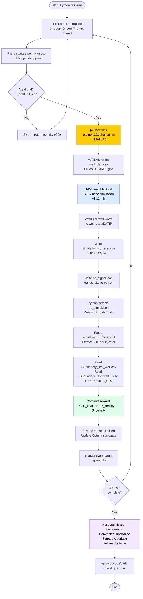

# Johansen CO₂ Storage — Bayesian Optimization of Injection Strategy
## Technical Documentation Report

---

| Field | Details |
|---|---|
| **Project** | Johansen CO₂ Storage — Bayesian Optimization of Injection Strategy |
| **Formation** | Johansen Sandstone Aquifer, North Sea, Offshore Norway |
| **Author** | [Author Name] |
| **Date** | [Document Date] |
| **Version** | 1.0 — Initial Release |
| **Status** | Draft for Stakeholder Review |
| **Classification** | Technical — Internal / Regulatory |

---

## Table of Contents

1. [Executive Summary](#1-executive-summary)
2. [Introduction & Scientific Background](#2-introduction--scientific-background)
3. [System Architecture](#3-system-architecture)
4. [Physical Constraints & Safety Conditions](#4-physical-constraints--safety-conditions)
5. [Optimization Methodology](#5-optimization-methodology)
6. [Parameter Space Design](#6-parameter-space-design)
7. [Well Configuration & Surveillance Strategy](#7-well-configuration--surveillance-strategy)
8. [Data Flow & File Specification](#8-data-flow--file-specification)
9. [Workflow Step-by-Step](#9-workflow-step-by-step)
10. [Results Interpretation Guide](#10-results-interpretation-guide)
11. [Failure Mode Handling](#11-failure-mode-handling)
12. [Limitations & Future Work](#12-limitations--future-work)
13. [Glossary](#13-glossary)

---

## 1. Executive Summary

The Johansen CO₂ Storage Bayesian Optimization (BO) System is an integrated reservoir engineering platform designed to maximize permanent geological storage of carbon dioxide in the Johansen sandstone aquifer of the North Sea. The system addresses a fundamental challenge in carbon capture and storage (CCS) project development: determining the optimal injection schedule — the right rates, start times, and durations — across a multi-well array while satisfying hard physical safety constraints. This is a problem of enormous practical consequence, as a suboptimal injection strategy can waste storage capacity, jeopardize caprock integrity, or allow CO₂ to migrate laterally out of the formation into non-containment zones.

The system couples a high-fidelity physics simulator (MATLAB/MRST) with a Bayesian Optimization engine (Python/Optuna) through a file-based handshake protocol. The physics simulator models one thousand years of CO₂ migration within a three-dimensional representation of the Johansen formation, capturing structural trapping beneath the caprock, residual trapping within pore space, and buoyancy-driven plume migration. Each simulation requires approximately 8–12 minutes of computation time, making exhaustive parameter search impractical — the BO engine solves this by learning a surrogate model of the objective function and directing the simulator toward promising regions of the parameter space with far fewer evaluations than grid search or Monte Carlo sampling would require.

Two hard physical safety conditions govern every trial. First, wellbore pressure at each active injector must not exceed 360 bar, the estimated fracture pressure of the Johansen caprock. A breach would risk creating hydraulic fractures in the seal, providing escape pathways for CO₂ into shallower formations or ultimately the marine environment. Second, CO₂ saturation at two strategically placed boundary surveillance wells must remain below the critical gas saturation threshold of 5%, confirming that the CO₂ plume remains contained within the reservoir footprint for the full 1,000-year simulation horizon. Both conditions are enforced through penalty terms in the reward function, ensuring that any trial violating a constraint is penalized heavily relative to the maximum achievable storage gain.

Over 40 optimization trials — ten random warm-up runs followed by thirty surrogate-guided iterations — the system identifies the injection strategy that maximizes permanent CO₂ storage while satisfying both safety constraints. Post-optimization diagnostics, including parameter importance analysis and surrogate surface visualization, provide engineering insight into which parameters most strongly govern storage performance, enabling well-justified design decisions for project regulators and stakeholders.

---

## 2. Introduction & Scientific Background

### 2.1 The Johansen Formation

The Johansen formation is an Early Jurassic fluvial-to-shallow-marine sandstone unit located in the Norwegian sector of the North Sea, in licenses PL001 and PL006, at depths of approximately 2,100–2,400 metres below sea level. It is one of the most thoroughly characterised saline aquifer storage targets in Europe, having been the subject of the Sleipner and Johansen CO₂ storage feasibility studies, and is the reference formation for several IEAGHG benchmark simulation studies.

The reservoir is bounded above by a laterally extensive shale caprock — the Dunlin Group — whose seal integrity makes the Johansen formation a structurally closed trap for buoyant supercritical CO₂. The reservoir is represented in this system as a 3D Cartesian grid of 100 × 100 × 11 cells, with layers 6–10 corresponding to the primary Johansen reservoir interval. This gridding is consistent with the MRST benchmark dataset, which provides realistic porosity and permeability distributions derived from well-log and core data.

### 2.2 CO₂ Trapping Mechanisms

Secure geological storage of CO₂ relies on multiple trapping mechanisms acting in concert, each with a different timescale:

**Structural Trapping** operates immediately upon injection. Supercritical CO₂ (which is less dense than formation brine) migrates upward under buoyancy until it accumulates beneath the low-permeability caprock. The volume of CO₂ that can be structurally trapped is limited by the geometry of the anticlinal or stratigraphic closure. In the Johansen formation, a gentle structural closure beneath the Dunlin shale provides primary structural containment.

**Residual Trapping** occurs as the CO₂ plume migrates through the rock. As the plume front advances, brine re-imbibes the pore space that CO₂ has vacated, leaving behind disconnected, immobile CO₂ ganglia — residual gas trapped by capillary snap-off. This is an entirely permanent mechanism; once trapped as residual saturation, CO₂ cannot be remobilised by any pressure gradient during normal reservoir conditions. Directional injection (see Section 7.2) is specifically designed to maximise the distance the plume travels, thereby increasing the volume of rock that undergoes drainage–imbibition cycling and thus the mass of CO₂ stranded as residual.

**Dissolution Trapping** occurs when CO₂ dissolves into formation brine over decades to centuries. CO₂-saturated brine is slightly denser than unsaturated brine, causing it to sink (convective dissolution), which accelerates further dissolution and ultimately produces stable bicarbonate ions in solution. This mechanism is modelled implicitly through the black-oil fluid model in MRST.

The simulation horizon of 1,000 years is deliberately chosen to allow all three mechanisms to manifest and stabilise, providing a physically meaningful measure of total permanent storage.

### 2.3 Why Injection Strategy Optimisation Matters

In a five-well injection array, the degrees of freedom include each well's injection rate, start time, and cessation time — giving at minimum ten free parameters. Pressure interference between wells means that injecting too aggressively across all wells simultaneously can drive wellbore pressures above the caprock fracture pressure even when individual wells would be safe in isolation. Conversely, excessively conservative rates sacrifice storage capacity and reduce the economic viability of the CCS project. Late starts may avoid pressure build-up but sacrifice the time available for residual trapping. Early cessation allows pressure dissipation before the simulation ends but reduces total injected mass. No analytical relationship exists between these parameters and the resulting CO₂ mass stored and pressure field — the only way to evaluate a given strategy is to run the full physics simulation.

### 2.4 Why Bayesian Optimisation

The per-evaluation cost of approximately 10 minutes in wall-clock time makes exhaustive search prohibitive. A six-parameter grid at five values per dimension contains 5⁶ = 15,625 combinations — roughly four months of continuous computation. Random search is unguided and equally inefficient. Bayesian Optimization is the principled solution: it treats the objective function as a black box and builds a probabilistic surrogate model that is cheap to evaluate. The surrogate is updated after each real simulator run, and an acquisition function balances exploration of uncertain regions against exploitation of regions the surrogate predicts to be rewarding. For simulator-constrained engineering optimisation problems, BO consistently outperforms grid search and genetic algorithms at the same evaluation budget, typically converging to within 5% of the global optimum in fewer than 50 trials.

---

## 3. System Architecture

The system is organized into three functional layers, each implemented in a distinct computational environment. The layers communicate exclusively through files written to a shared working directory — a deliberate design choice that makes the system tolerant of crashes, user interruptions, and environment mismatches between MATLAB and Python.

### 3.1 Architecture Diagram

### 3.2 Layer 1 — Physics Simulator (MATLAB / MRST)

The physics layer is implemented in MATLAB R2025b using MRST-2026a (Matlab Reservoir Simulation Toolbox), an open-source reservoir simulation framework developed at SINTEF. The simulation script `example3DJohansen.m` reads injection parameters from `well_plan.csv`, constructs the MRST grid with the Johansen formation geometry and petrophysical properties, configures a black-oil model with CO₂ as the gas phase and formation brine as the water phase, and advances the simulation in variable timesteps over 1,000 years.

The simulator resolves capillary trapping, relative permeability hysteresis, buoyancy, and compressibility. At the end of the run, it writes per-well pressure and saturation time series, a plain-text simulation summary, and a JSON handshake signal indicating that the result is ready for Python to read.

### 3.3 Layer 2 — Bayesian Optimisation Engine (Python / Optuna)

The optimisation layer is implemented as a Jupyter notebook (`johansen_bo_handshake.ipynb`) using the Optuna framework. Optuna is a hyperparameter optimisation library that implements the Tree-structured Parzen Estimator (TPE) algorithm. The notebook manages the full trial lifecycle: parameter proposal, file writing, signal polling, result parsing, reward computation, surrogate update, and progress visualisation. All trial results are persisted to `bo_results.json` after every trial, enabling full restart from any interruption point.

### 3.4 Layer 3 — Exploratory Data Analysis (Python / Jupyter)

A separate notebook (`johansen_eda.ipynb`) provides post-hoc visual analysis of simulation outputs, including pressure evolution maps, CO₂ plume migration animations, well performance time series, and seal pressure alert dashboards. This layer reads from the same `well_csvs/` directory structure as the BO engine but does not write any handshake files.

---

## 4. Physical Constraints & Safety Conditions

The optimisation is subject to two hard physical constraints derived from the geomechanical and petrophysical properties of the Johansen formation. Both are enforced as penalised inequality constraints within the reward function.

> ⚠️ **Warning — Safety Critical:** Both conditions below represent engineering safety limits with direct consequences for formation integrity and regulatory compliance. A trial is classified as "fully safe" only when both conditions are simultaneously satisfied with zero penalty. The best safe trial — not the highest-reward trial — is used to generate the final well plan.

### 4.1 Condition 1 — Caprock Seal Integrity (BHP Constraint)

**Physical Basis:** Supercritical CO₂ is injected at depth, elevating fluid pressure in the near-wellbore zone. If wellbore pressure (Bottom Hole Pressure, BHP) exceeds the minimum principal stress of the caprock rock, hydraulic fractures can propagate into the seal, creating permeable pathways through which buoyant CO₂ can escape vertically into shallower formations or the water column. The critical fracture pressure for the Johansen Dunlin shale caprock is estimated at **360 bar**.

**Formal Specification:**

$$P_{\text{BHP}, w}(t) \leq P_{\text{frac}} = 360 \text{ bar} \quad \forall\, w \in \mathcal{W}_{\text{inj}}, \; \forall\, t \in [0, T_{\text{sim}}]$$

where $\mathcal{W}_{\text{inj}}$ is the set of all five active injector wells and $T_{\text{sim}} = 1{,}000$ years.

**Penalty Term:**

$$\Phi_{\text{BHP}} = \sum_{w \in \mathcal{W}_{\text{inj}}} 50 \cdot \max\!\left(0,\; \hat{P}_{w} - 360\right)$$

where $\hat{P}_{w}$ is the peak BHP (in bar) recorded at well $w$ over the entire simulation duration, extracted from the `BHP_WELL <name>` lines in `simulation_summary.txt`. The penalty coefficient of 50 is calibrated so that a 10-bar exceedance (a physically significant overpressure) incurs a 500 Mt equivalent penalty — approximately equal to the total storage achievable by a highly optimised strategy, ensuring that no BHP-violating trial can outrank a safe one.

> ⚠️ **Warning:** The BHP constraint is checked individually per injector. It is insufficient to check only the maximum BHP across all wells; a strategy that keeps the fleet average below 360 bar while one injector peaks at 380 bar would violate Condition 1. Each of the five wells is evaluated independently.

### 4.2 Condition 2 — CO₂ Containment (Saturation Constraint)

**Physical Basis:** CO₂ that migrates laterally to the western boundary of the active reservoir grid risks exiting the modelled domain into poorly characterised rock beyond the structural closure, where containment cannot be guaranteed. The critical gas saturation $S_{gc}$ from the Johansen relative permeability curves is **5% (0.05)**. Below this threshold, CO₂ occupies pore throats as isolated ganglia with zero relative permeability — it is immobile and cannot contribute to further migration. Once saturation at the boundary exceeds $S_{gc}$, CO₂ is mobile at that location, indicating active breakthrough toward the formation boundary.

**Formal Specification:**

$$\max_{k,\, t}\, S_{\text{CO}_2}^{(w, k)}(t) < S_{gc} = 0.05 \quad \forall\, w \in \mathcal{W}_{\text{bound}},\; k \in \{6,7,8,9,10\},\; t \in [0, T_{\text{sim}}]$$

where $\mathcal{W}_{\text{bound}} = \{\text{SBoundary\_test\_well},\; \text{SBoundary\_test\_well\_2}\}$ are the two western boundary surveillance wells.

**Penalty Term:**

$$\Phi_{S} = \sum_{w \in \mathcal{W}_{\text{bound}}} 500 \cdot \max\!\left(0,\; \hat{S}_{w} - 0.05\right)$$

where $\hat{S}_{w}$ is the maximum CO₂ saturation observed at well $w$ across all layers and all timesteps. The penalty coefficient of 500 is ten times larger than the BHP penalty coefficient, reflecting the irreversible nature of a containment failure: once CO₂ exits the modelled domain, no corrective injection strategy can recover it.

### 4.3 Composite Reward Function

$$\boxed{ r = Q_{\text{CO}_2}^{\text{total}} \;-\; \Phi_{\text{BHP}} \;-\; \Phi_{S} }$$

where $Q_{\text{CO}_2}^{\text{total}}$ is the total CO₂ mass permanently stored (in Mt), read from `simulation_summary.txt`. Optuna minimises $-r$, which is equivalent to maximising $r$. A trial with zero penalty on both conditions is classified as **fully safe**; the best safe trial — highest $r$ among all zero-penalty trials — determines the final recommended injection strategy.

---

## 5. Optimization Methodology

### 5.1 Tree-Structured Parzen Estimator (TPE)

Optuna's TPE algorithm is the surrogate-based optimiser used by this system. TPE is a sequential model-based optimisation (SMBO) method that models the objective function probabilistically rather than analytically. After each real simulator evaluation, TPE partitions observed trials into two sets: a "good" set $\mathcal{G}$ of trials whose reward exceeds a quantile threshold $\gamma$ (typically $\gamma = 0.25$), and a "bad" set $\mathcal{B}$ comprising the remainder. It then fits separate kernel density estimates (KDEs) $\ell(x)$ and $g(x)$ over the parameter space for each set.

The acquisition function is the ratio $\ell(x) / g(x)$, which is maximised to select the next trial. Intuitively, TPE proposes parameters that are likely under the distribution of good trials and unlikely under the distribution of bad trials. Unlike Gaussian Process Bayesian Optimisation (GP-BO), TPE scales well to higher-dimensional parameter spaces and handles discrete and conditional parameters naturally — properties well-suited to the six-dimensional mixed continuous/integer space used here.

### 5.2 Warm-Up Phase (Trials 1–10)

The first ten trials are drawn using random sampling (Optuna's `RandomSampler`), providing a diverse initial coverage of the parameter space before the surrogate is conditioned. This warm-up phase is essential: a TPE model conditioned on fewer than approximately five data points does not have sufficient information to reliably distinguish good from bad regions. The warm-up also serves to anchor the surrogate near the boundaries of the feasible space, preventing it from becoming overconfident in unexplored regions.

### 5.3 BO-Guided Phase (Trials 11–40)

From trial 11 onward, the TPE sampler takes over, proposing each new trial by maximising the acquisition function over the KDE surrogates built from all previous results. The surrogate is updated after every real simulation, so each successive proposal is informed by a richer dataset. The practical effect is that the proposal distribution progressively concentrates around the region of parameter space that delivers high CO₂ storage without violating either physical constraint.

### 5.4 Crash Safety and Resume Capability

All trial results — including parameter values, raw CO₂ totals, per-well BHP values, boundary saturations, computed penalties, and final reward — are serialised to `bo_results.json` immediately after each trial. If the Python kernel is interrupted or the system crashes, the optimisation can be resumed from the saved state by reloading `bo_results.json` and re-seeding the Optuna study with the recorded trials before continuing from the next trial number.

---

## 6. Parameter Space Design

The optimisation parameter space covers six independent variables, grouped by well cluster. The bounds for each parameter were chosen based on engineering constraints, formation capacity estimates, and regulatory limits.

| Parameter | Min | Max | Step | Rationale for Bounds |
|---|---|---|---|---|
| `Q_deep` | 0.30 Mt/yr | 3.00 Mt/yr | 0.05 | Lower bound: minimum practical injection rate for maintaining wellbore flow assurance. Upper bound: rate at which pressure interference between the four deep wells begins to exceed caprock fracture pressure even at low formation pressure. |
| `Q_central` | 0.30 Mt/yr | 3.00 Mt/yr | 0.05 | Same rationale as Q_deep; the central well (31/05/07) is sufficiently separated spatially that it can be rated independently without guaranteed interference with the deep cluster. |
| `T_start_deep` | 0 yr | 20 yr | 1 | A start delay of up to 20 years allows for formation pressure dissipation from prior activity or staged development. Delays beyond 20 years were found in scoping runs to reduce total injected mass without sufficient pressure benefit to justify the loss. |
| `T_end_deep` | 30 yr | 200 yr | 1 | Lower bound of 30 years ensures a minimum injection duration of at least 10 years for any valid combination with T_start. Upper bound of 200 years reflects the regulatory injection window and the point at which formation pressure builds to unsafe levels for long injection durations at maximum rates. |
| `T_start_cen` | 0 yr | 20 yr | 1 | Same rationale as T_start_deep. Staggering the central well start time relative to the deep cluster is a key BO-discoverable strategy for pressure management. |
| `T_end_cen` | 30 yr | 200 yr | 1 | Same rationale as T_end_deep. |

**Guard Condition:** Any trial for which `T_start_deep ≥ T_end_deep` or `T_start_cen ≥ T_end_cen` is invalid (negative or zero injection duration). Such trials are detected before the simulation is launched and returned immediately with a penalty reward of −9,999, preventing them from polluting the surrogate with physically meaningless data.

### 6.1 Directional Injection Rationale

The four deep injectors are configured with a directional transmissibility mask that allows CO₂ flow only in the +I direction (westward, away from the structural crest and toward the formation interior). This is implemented by zeroing the MRST transmissibility tensor on the −I half-faces of the well cells. The practical effect is that the injected CO₂ plume is forced to travel a longer lateral path before encountering the reservoir boundary, exposing more pore volume to drainage–imbibition cycling and thereby trapping a greater proportion of the injected mass as immobile residual CO₂. This increases storage permanence independent of the injection rate or schedule and is treated as a fixed design choice rather than an optimisation variable.

---

## 7. Well Configuration & Surveillance Strategy

### 7.1 Active Injector Wells

| Well Name | Role | Grid I | Grid J | Configuration |
|---|---|---|---|---|
| 31/01/01 | Injector (deep cluster) | 43 | 43 | Directional (+I only); shares Q_deep and T schedule |
| 31/1-3 S | Injector (deep cluster) | 39 | 40 | Directional (+I only); shares Q_deep and T schedule |
| 31/2-5 | Injector (deep cluster) | 50 | 47 | Directional (+I only); shares Q_deep and T schedule |
| 31/05/02 | Injector (deep cluster) | 57 | 50 | Directional (+I only); shares Q_deep and T schedule |
| 31/05/07 | Injector (central) | 51 | 51 | Omnidirectional; independent Q_central and T schedule |

The four deep cluster wells share a single set of rate and timing parameters (`Q_deep`, `T_start_deep`, `T_end_deep`). This reduces the parameter space from a potential 12 dimensions (two parameters per well × 6 wells) to 6, a reduction that dramatically improves BO convergence at the 40-trial budget. The central well 31/05/07 is geographically separated from the deep cluster and is given independent rate and timing parameters to allow the optimiser to discover strategies that use the central well to supplement the deep cluster during pressure recovery periods.

### 7.2 Surveillance / Observation Wells

| Well Name | Type | Grid I | Grid J | Purpose |
|---|---|---|---|---|
| 31/4-3 | Observation | 29 | 52 | Legacy monitoring well; provides mid-formation pressure and saturation diagnostics |
| 31/07/01 | Observation | 25 | 32 | Upper-left monitoring; tracks plume migration toward the northern boundary |
| SBoundary_test_well | Surveillance (Condition 2) | 1 | 53 | Western boundary, southern flange — inline with 31/05/07 and 31/4-3 |
| SBoundary_test_well_2 | Surveillance (Condition 2) | 1 | 32 | Western boundary, northern flange — inline with 31/07/01 |

### 7.3 Two-Flange Boundary Surveillance Design

The use of two boundary surveillance wells rather than a single sentinel is a deliberate design choice motivated by the asymmetric geometry of the injection array. The southern injector cluster (31/05/07 at J=51, 31/4-3 at J=52) directs plumes along a southern lateral trajectory that would reach the western boundary near J=53 — monitored by `SBoundary_test_well`. The northern monitoring well (31/07/01 at J=32) is aligned with a distinct migration pathway that exits near J=32 — monitored by `SBoundary_test_well_2`. A single boundary well at either location would be blind to breakthrough on the opposite flange, potentially allowing a physically unsafe strategy to appear constraint-compliant.

Both surveillance wells sit at grid column I=1, the westernmost active column of the reservoir. Any CO₂ saturation above $S_{gc}$ at these locations indicates that the plume has traversed the full lateral extent of the modelled domain and has reached the formation boundary.

---

## 8. Data Flow & File Specification

| File | Location | Writer | Reader | Format | Role |
|---|---|---|---|---|---|
| `well_plan.csv` | `data/` | Python (BO) | MATLAB | CSV | **Primary interface file** — injection parameters for current trial |
| `well_plan_BACKUP_BO.csv` | `data/` | User (manual) | Python | CSV | Template backup — never overwritten by BO engine; basis for all trial writes |
| `bo_signal.json` | `python/` | MATLAB | Python | JSON | Handshake — written at simulation end; deleted by Python after reading |
| `bo_pending.json` | `python/` | Python | User / logging | JSON | Documents trial number, params, and timestamp while MATLAB is running |
| `bo_results.json` | `python/` | Python | Python (resume) | JSON | Crash-safe persisted record of all completed trial results |
| `bo_live_progress.png` | `python/` | Python | User (viewer) | PNG | Live-updated 3-panel progress chart |
| `simulation_summary.txt` | `well_csvs/DATE/` | MATLAB | Python | Plain text | CO₂ totals, per-injector peak BHP, observation well table |
| `SBoundary_test_well.csv` | `well_csvs/DATE/` | MATLAB | Python | CSV | S_CO₂ time series at western boundary, southern flange |
| `SBoundary_test_well_2.csv` | `well_csvs/DATE/` | MATLAB | Python | CSV | S_CO₂ time series at western boundary, northern flange |
| Per-well CSVs (injectors, obs) | `well_csvs/DATE/` | MATLAB | EDA notebook | CSV | Pressure and saturation time series — used in Layer 3 EDA only |

**Date-stamped output folder:** Each MATLAB run creates a subfolder under `well_csvs/` named `DD_MM_YYYY__HH_MM/`, providing a complete archive of every trial's simulation outputs without overwriting previous runs. The `bo_signal.json` contains the path to the most recently created folder, allowing Python to locate the correct outputs even when multiple runs have been performed.

---

## 9. Workflow Step-by-Step

The following procedure describes operation of the full BO workflow for a single trial. Steps 1–14 repeat for each of the 40 trials.

1. **Launch the Python notebook.** Open `johansen_bo_handshake.ipynb` in Jupyter and execute all initialisation cells. The notebook loads `well_plan_BACKUP_BO.csv` as the injection parameter template and initialises (or resumes) the Optuna study from `bo_results.json`.

2. **Optuna proposes parameters.** For trials 1–10, the `RandomSampler` draws from the uniform parameter space. For trials 11–40, the `TPESampler` proposes based on the current surrogate.

3. **Guard check.** The notebook verifies `T_start < T_end` for both well groups. If violated, the trial is skipped with reward −9,999 and the next trial is immediately proposed.

4. **Python writes `well_plan.csv`.** The proposed parameters are written to `data/well_plan.csv`, overwriting the previous trial's plan. The backup file `well_plan_BACKUP_BO.csv` is never touched.

5. **Python writes `bo_pending.json`.** This file documents the trial number, all six parameter values, and a UTC timestamp, providing an audit trail for the current pending run.

6. **Python prints user instruction.** The notebook cell outputs: `▶ NOW: Switch to MATLAB and run example3DJohansen.m`. Python then enters a 30-second polling loop waiting for `bo_signal.json` to appear.

7. **User switches to MATLAB.** The operator switches focus to the MATLAB environment and runs `example3DJohansen.m`. No modification to the script is required between trials.

8. **MATLAB reads `well_plan.csv`.** The simulation script reads the injection parameters, configures wells in the MRST model, and begins the 1,000-year transient simulation.

9. **MATLAB runs the simulation.** Elapsed time is approximately 8–12 minutes per trial, depending on hardware and the specific injection scenario (higher rates produce steeper pressure gradients requiring finer adaptive timesteps).

10. **MATLAB writes output files.** At simulation completion, MATLAB writes all per-well CSV time series, `simulation_summary.txt`, and the CO₂ trapping inventory plot to the timestamped folder under `well_csvs/`.

11. **MATLAB writes `bo_signal.json`.** This JSON file contains the path to the new output folder and the completion timestamp. Writing this file last ensures Python cannot begin parsing outputs before they are fully written.

12. **Python detects the signal.** The polling loop detects `bo_signal.json`, reads the output folder path, and deletes `bo_signal.json` to prevent stale reads in subsequent trials.

13. **Python parses results.** The notebook reads `simulation_summary.txt` for total CO₂ stored and per-injector peak BHP, then reads both `SBoundary_test_well.csv` and `SBoundary_test_well_2.csv` to extract the maximum CO₂ saturation at each boundary well across all layers and all timesteps.

14. **Python computes reward and updates surrogate.** The reward function is evaluated, the result is saved to `bo_results.json`, the Optuna study surrogate is updated, and the live progress chart is regenerated. The workflow returns to Step 2 for the next trial.

---

## 10. Results Interpretation Guide

### 10.1 Live Progress Chart

After each trial, the system generates a three-panel figure (`bo_live_progress.png`):

**Panel 1 — CO₂ Stored per Trial:** Each bar represents the total CO₂ mass injected in a given trial (in Mt). A running best-safe line overlays the bars. Bars are colour-coded: **green** for fully safe trials (zero BHP penalty, zero saturation penalty), **amber** for trials with BHP violations only, **red** for trials with containment violations, and **dark red** for trials violating both conditions. The operator should look for an upward trend in the green bar heights as the surrogate converges.

**Panel 2 — Peak BHP per Trial:** One data point per injector per trial. The horizontal dashed red line at 360 bar marks the caprock fracture limit. Data points above this line correspond to trials that violate Condition 1. If all points cluster near or below 360 bar by trial 20–30, the surrogate has learned the BHP constraint boundary effectively.

**Panel 3 — Boundary S_CO₂ per Trial:** Two series per trial — one for each surveillance well. The dashed red line at 0.05 (5%) marks the critical gas saturation. Saturation values above this line indicate containment violations. Near-zero values across all trials indicate that the directional injection design is successfully keeping the plume away from the boundary at the evaluated rates.

### 10.2 Identifying the Best Safe Trial

At the conclusion of 40 trials, the notebook generates a full results table sorted by reward in descending order. The colour coding in this table is: **green highlight** for the single best fully safe trial; **grey** for all other safe trials; **red** for any trial with a BHP violation; **orange** for any trial with a containment violation; **dark red** for trials with both violations. The recommended injection strategy corresponds to the green row. Parameters for this trial are applied to `well_plan.csv` using the "Apply best" function.

### 10.3 Parameter Importance Analysis

A Random Forest regression model is trained on all 40 (parameter, reward) pairs. The Gini importance values for each of the six parameters indicate which parameters the surrogate has learned to be most influential. A high importance for `T_end_deep` with low importance for `T_start_cen`, for example, suggests that total injection duration for the deep cluster is the primary driver of storage volume, while the timing of the central well is a secondary fine-tuning variable. This information is valuable for regulatory documentation as it supports the rationale for the final well plan.

---

## 11. Failure Mode Handling

### 11.1 MATLAB Crashes Mid-Simulation

If MATLAB crashes before writing `bo_signal.json`, Python's polling loop will continue indefinitely. The operator should press `Ctrl+C` in the Python notebook to interrupt the poll, then restart MATLAB and re-run `example3DJohansen.m`. Because `bo_pending.json` records which trial was pending, the operator can verify the trial number and re-run the same trial parameters. The study will accept the late result and continue normally. `bo_results.json` will not have been updated for the failed trial, so the surrogate state is consistent.

### 11.2 Python Kernel Interrupted (Ctrl+C)

If the Python notebook kernel is interrupted between trials (i.e., after `bo_results.json` has been updated for the last completed trial), the study can be resumed by re-executing all notebook cells. The Optuna study is re-created from `bo_results.json`, which contains all prior trial parameters and rewards. The surrogate state is exactly reproduced from this record, and optimisation continues from the next trial number.

> ⚠️ **Warning:** If the kernel is interrupted while Python is writing `bo_results.json`, the file may be partially written and become corrupt. In this case, restore `bo_results.json` from a manual backup or reconstruct it from the timestamped `simulation_summary.txt` files in `well_csvs/`. The folder timestamps provide an audit trail that allows recovery of all completed trial results.

### 11.3 No Safe Trials Found After 40 Runs

If the full 40-trial budget completes without any trial satisfying both physical conditions simultaneously, the operator should not apply any trial's parameters to the final well plan. Instead, the parameter importance analysis should be reviewed to identify which parameter is most strongly associated with constraint violations. The most common cause is `Q_deep` being sampled predominantly at high values, driving BHP above 360 bar. In this case, the search bounds should be revised — reducing `Q_deep_max` from 3.00 to 2.00 Mt/yr — and the optimisation restarted with a fresh study.

### 11.4 Stale `bo_signal.json` from a Previous Run

If `bo_signal.json` exists in `python/` at the start of a new trial (e.g., because the notebook was restarted after a run completed but before signal deletion occurred), Python will immediately read it and attempt to parse the folder it points to. To prevent this, the notebook's initialisation cell checks for and deletes any pre-existing `bo_signal.json` before beginning trial 1 or before resuming a study.

---

## 12. Limitations & Future Work

### 12.1 Current Limitations

**Manual Handshake Requirement.** The current architecture requires the operator to manually switch between Python and MATLAB environments and trigger each simulation run. This introduces human latency between trials and is incompatible with overnight or unattended operation. A single 40-trial campaign typically requires one to two full working days of operator availability.

**Shared Rate Parameterisation.** All four deep injector wells share a single injection rate (`Q_deep`). In a real formation with spatial heterogeneity in permeability and transmissibility, individual well rates may need to differ significantly to achieve a uniform pressure field. The current parameterisation cannot discover such spatially differentiated strategies.

**No Dissolution Trapping Objective.** The reward function measures total CO₂ injected, which encompasses all trapping mechanisms equally. Dissolution trapping is particularly permanent and valuable; an objective that weights dissolved CO₂ more heavily than free-plume CO₂ would produce a fundamentally different optimal strategy, likely favouring slower, longer injection to maximise contact time with unsaturated brine.

**40-Trial Budget.** For a six-dimensional optimisation problem, 40 trials may be insufficient to fully characterise the objective surface. Scoping studies with higher-fidelity surrogate benchmarks (e.g., Latin Hypercube Sampling at 100 points) would provide confidence bounds on the TPE convergence.

### 12.2 Future Work

**Automated MATLAB Launch.** Python can invoke MATLAB from the command line using `subprocess.Popen(['matlab', '-batch', 'example3DJohansen'])`, eliminating the manual handshake step. This would enable true unattended overnight operation and allow the trial budget to be increased to 100–200 trials without operator involvement.

**Multi-Objective Optimisation.** Optuna supports multi-objective optimisation via `NSGAIISampler`. A future extension could simultaneously maximise both total CO₂ stored and the fraction trapped as residual (most permanent), producing a Pareto front that allows regulators to select their preferred balance between storage volume and permanence.

**Individual Well Rate Optimisation.** Parameterising each of the five injectors independently increases the search space to 15 dimensions (rate + start + end per well), which exceeds practical BO efficiency at a 40-trial budget. However, with automated MATLAB launch enabling a 200-trial budget, individual well parameterisation becomes tractable and may unlock significantly higher storage through spatially optimised pressure management.

**Ensemble Uncertainty Quantification.** Replacing the single deterministic MRST model with an ensemble of petrophysical realisations (varying porosity and permeability fields) would allow robust optimisation under geological uncertainty — identifying injection strategies that perform well across all plausible realisations of the formation, not just the mean model.

---

## 13. Glossary

| Term | Definition |
|---|---|
| **BHP** | Bottom Hole Pressure — the fluid pressure measured at the depth of the wellbore perforations. For an injector, BHP is higher than formation pressure due to the injection pressure required to push fluid into the rock. |
| **Black-oil model** | A reservoir simulation formulation that treats the reservoir fluid system as two phases (gas and water in this CO₂ context) with simplified, pressure-dependent fluid properties, without requiring full compositional tracking. |
| **Caprock** | The low-permeability geological layer (here: the Dunlin shale) that sits above the reservoir and acts as a seal, preventing buoyant CO₂ from migrating upward. |
| **Critical gas saturation (S_gc)** | The minimum CO₂ saturation at which the gas phase becomes hydraulically connected and mobile. Below S_gc, CO₂ exists as isolated, immobile ganglia with zero relative permeability. |
| **EDA** | Exploratory Data Analysis — the visual and statistical investigation of simulation output data to identify patterns, anomalies, and engineering insights. |
| **Gaussian Process (GP)** | A probabilistic model that defines a distribution over functions. GP-BO uses a GP to model the objective function and provides uncertainty estimates that guide the acquisition function. |
| **KDE** | Kernel Density Estimate — a non-parametric method for estimating the probability density of a set of observations, used by TPE to model the distributions of good and bad trial parameters. |
| **MRST** | Matlab Reservoir Simulation Toolbox — an open-source MATLAB library developed by SINTEF for reservoir simulation and CO₂ storage modelling. |
| **Mt/yr** | Megatonnes per year — the unit of CO₂ injection rate used in this system. One megatonne = 10⁶ metric tons = 10⁹ kg. |
| **Residual trapping** | The immobilisation of CO₂ as disconnected ganglia in pore space following brine re-imbibition of a drained region. Considered the most secure trapping mechanism on engineering timescales. |
| **S_CO₂** | CO₂ saturation — the fraction of pore volume occupied by CO₂ at a given location and time, ranging from 0 (brine-saturated) to 1 (fully CO₂-saturated). |
| **Structural trapping** | The accumulation of buoyant CO₂ beneath a low-permeability structural or stratigraphic seal (caprock), analogous to conventional natural gas accumulation. |
| **Surrogate model** | A computationally cheap mathematical approximation of an expensive function (here: the MRST simulator). The surrogate is built from prior evaluations and used to guide the selection of new evaluation points. |
| **TPE** | Tree-structured Parzen Estimator — the Bayesian Optimisation algorithm implemented in Optuna, which models the acquisition function as the ratio of two kernel density estimates over the parameter space. |
| **Transmissibility** | A measure of the ease of fluid flow between adjacent grid cells in a reservoir simulation, defined as the harmonic average of the cell permeabilities weighted by cell geometry. In this system, transmissibilities are selectively zeroed to enforce directional injection. |

---

*End of Document*

---
*Document prepared using the Johansen CO₂ Storage BO System — Technical Documentation Template v1.0*
